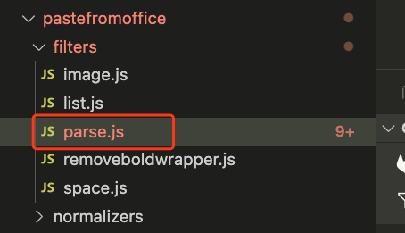

# 兼容将 word 中内容拷贝到编辑器下划线内容不一致

## 需求背景

在从 word 拷贝到编辑器时，在 word 中是\_\_\_，到了编辑器中是————————；

## 出现的原因

在编辑器读取剪切板内容的时候，对内容进行处理的时候，部分下划线的 font-family 被修改了；

## 解决逻辑

在的 parse 文件中，将内容仅是一个或者多个下划线的 font-family 设置为`Times New Roman;`，这样就可以正常显示；

```js
normalizedHtml = normalizedHtml.replace(
  /<span([^>]*style='[^']*)font-family:楷体([^']*'[^>]*)>(_+)(<o:p><\/o:p>|)<\/span>/g,
  "<span $1font-family:Times New Roman;$2>$3</span>"
);
```
